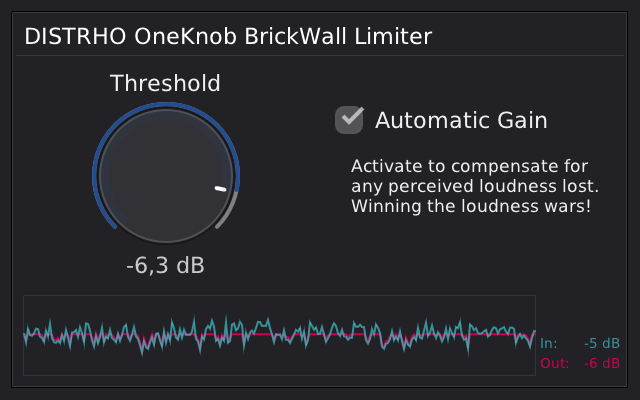

# DISTRHO OneKnob Series

A collection of stupidly simple but well-polished and visually pleasing audio plugins,
with as little controls as possible,
often just one knob and a few options.

This is very much WORK IN PROGRESS!

This collection currently includes: 
 - A/B Input Selector
 - A/B Output Selector
 - Brickwall Limiter
 - Compressor
 - Convolution Reverb
 - Devil's Distortion

## Screenshots

A/B Input Selector: 
 

A/B Output Selector: 
 

Brickwall Limiter: 
 

Compressor: 
 

Convolution Reverb: 
 

Devil's Distortion: 
 

## Guidelines

The guidelines for the collection are:
 - Must have one main control/knob (linear or logarithmic), with one auxiliary control/knob allowed but discouraged
 - Can have maximum 3 auxiliary options (list of values or toggles)
 - DSP must be click-free
 - GUI must be cleanly scalable (no bitmaps allowed or blurred resources when scaled)
 - GUI must follow the same style
