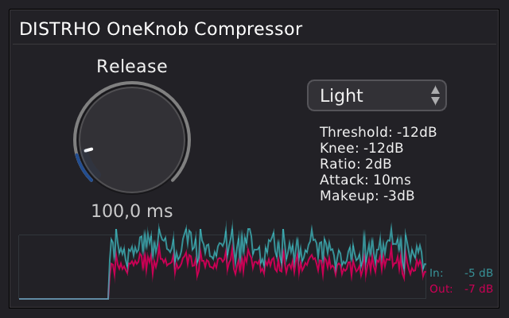
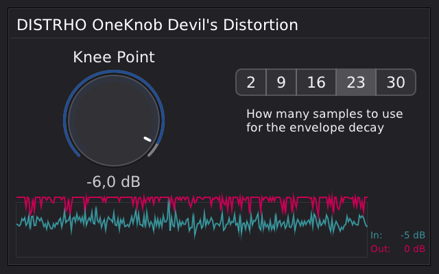

# DISTRHO OneKnob Series

A collection of stupidly simple but well-polished, pleasent and functional audio plugins with as little controls as possible.
There is always only 1 knob, hence the name.
Other small helper controls might be available where it makes sense to have them.

This is very much WORK IN PROGRESS!

This base release of this collection will include: 
 - A/B Input Selector
 - A/B Output Selector
 - Brickwall Limiter
 - Compressor
 - Convolution Reverb
 - Devil's Distortion
 - One Sampler
 - Reverb

## Mockups

## Screenshots

A/B Input Selector: 
 

A/B Output Selector: 
 

Brickwall Limiter: 
 

Compressor: 
 

Convolution Reverb: 
 

Devil's Distortion: 
 

## Guidelines

The guidelines for the collection are:
 - Must have one main control/knob (linear or logarithmic), with one auxiliary control/knob allowed but discouraged
 - Can have maximum 3 auxiliary options (list of values or toggles)
 - DSP must be click-free
 - GUI must be cleanly scalable (no bitmaps allowed or blurred resources when scaled)
 - GUI must follow the same style
